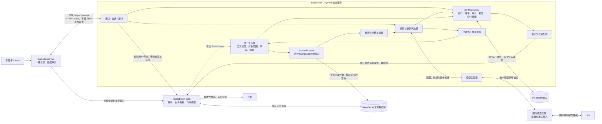
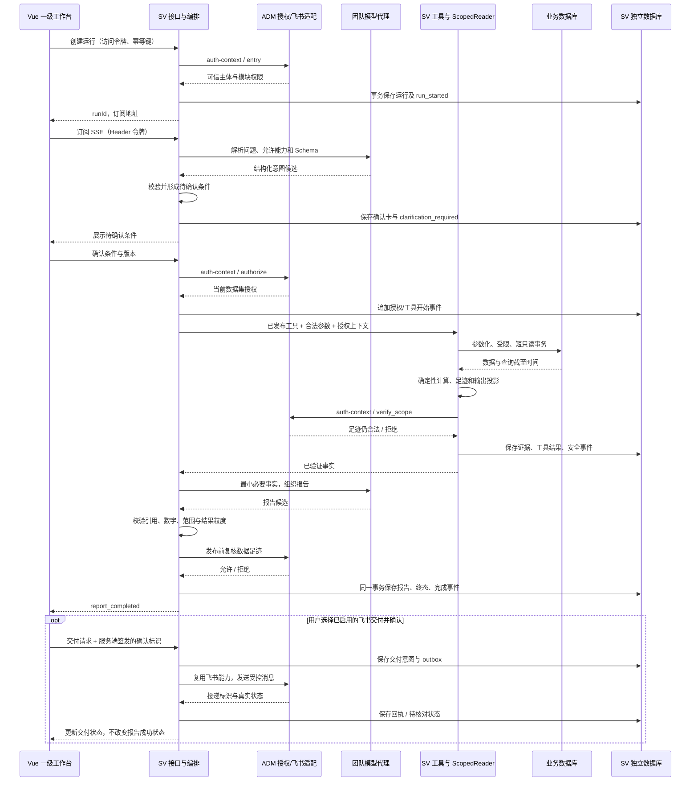
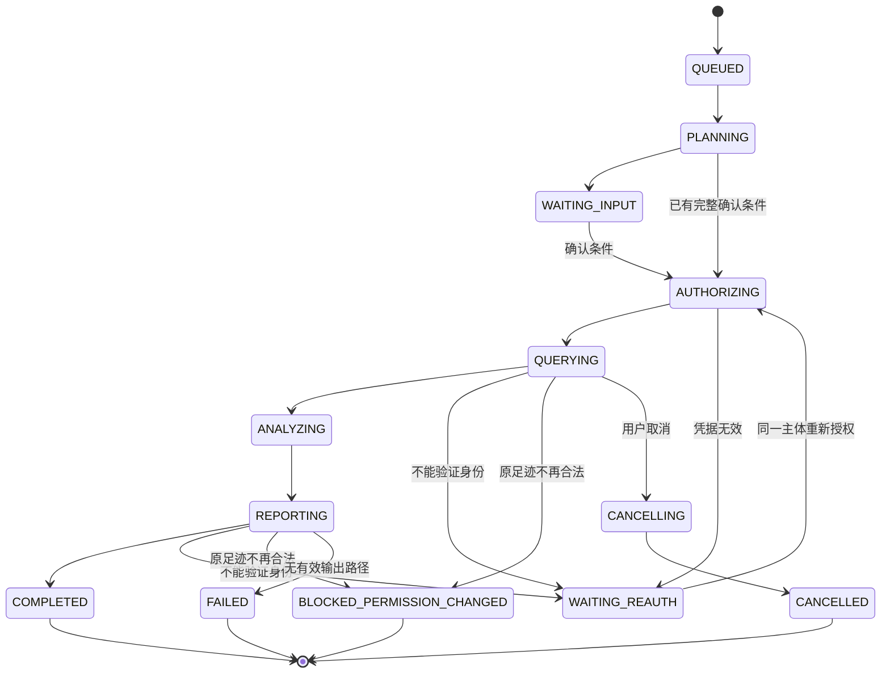

# Supervisor 数据审计工作台：详细设计 v3

> 日期：2026-09-17  
> 状态：按最新需求重写的实施设计，尚未实现、部署或完成业务验收。  
> 配套文档：[02_Supervisor_决策记录与实施核验_v3.md](02_Supervisor_决策记录与实施核验_v3.md)。  
> 核心：**ADM 负责用户授权；SV 自带工具、只读查询业务库、写独立 SV 数据库；飞书发送复用 ADM；模型仅通过团队统一代理；页面是 SalesBoost-vue 一级目录。**

## 阅读约定

**【用户确定】**来自本次或此前已确认需求；**【本版决策】**是用户授权本次代为决定的技术边界；**【代码核验】**来自实际读取的文件；**【环境待核验】**表示未取得现场证据，不能凭设计认定已经成立。

本文是对两份 v2 文档的重写，不是原文摘要。原材料约束保留与变化见第 3 节；源码依据和技术资料分别使用 `[Cxx]`、`[Wxx]`，索引见附录。所有新接口、类型、表名与示例权限码均为拟实施契约，不代表仓库已有。

**“不列出第一版需要做的审计功能”按不预定首个产品版本的业务功能清单处理。**本文仍设计数据审计平台的技术能力、记录方式和扩展契约；不把课程完成率、负担审计、A–G 规则、考试或任何工具示例写成交付承诺。业务能力通过注册目录逐项接入，工程建设顺序不等于产品功能排期。

“只读”只约束 SalesBoost **业务数据库**。SV 自己的会话、审计、报告、证据、运行、安全日志及交付请求必须由 SV 写入**单独的逻辑数据库**；不能把“只读”误解为 SV 无法保存状态。

## 快速定位

| 目的 | 章节 |
|---|---|
| 架构、变化、语言选择、真实基线 | 第 1–5 节 |
| 登录与请求身份 | [第 6 节](#s6) |
| ADM 最小授权接口与历史权限 | [第 7 节](#s7) |
| 工具、模型 SQL、工具生成决策 | [第 8 节](#s8) |
| 业务只读与 SV 独立库写入 | [第 9 节](#s9) |
| 数据、记录、团队代理与运行 | 第 10–19 节 |
| 一级菜单与课件页面风格对齐 | [第 20 节](#s20) |
| 飞书、部署、工程与验收 | 第 21–26 节 |

---

## 1. 产品定位与不变边界

SV 是管理者在 SalesBoost 中使用的数据审计工作台，负责理解问题、确认条件、使用已授权数据、执行可复核计算并保留报告和记录。[S1]

### 1.1 本版确认的边界

| 项目 | 决定 |
|---|---|
| 产品位置 | SalesBoost-vue **一级目录**，与“在线课件”等一级模块平级；菜单排序待安排 |
| 样式基准 | 实际 Vue 页面“在线课件 → 生成新课件”，包括入口和进入后的工作台 |
| 用户体系 | 只沿用 ADM 登录、账号和业务权限，不建设第二套角色/组织系统 |
| 分析执行 | 全部工具、查询适配、指标、规则、编排在 SV |
| 数据读写 | SV 只读业务库；SV 独立数据库由 SV 写入 |
| 消息出口 | 只有 ADM 使用飞书凭据并发送消息 |
| 模型出口 | 只有团队统一代理；具体地址、鉴权和模型别名后续注入集群 |
| 技术语言 | SV 采用 Python；Vue 仍使用 TypeScript，不共用后端运行时 |
| 业务功能范围 | 本文不冻结任何首版审计功能、规则或阈值清单 |

### 1.2 四种不同对象

**培训业务对象**是任务、课件、执行实例等源数据；**SV 运行**是一轮分析处理；**业务审计记录**是保存的观察和结论；**安全审计事件**是访问、授权、工具及动作的留痕。这四者不能混为一个“审计表”。

SV 不修改培训任务、组织、员工、课件和成绩。报告建议不是已经执行的业务调整；“本次未再发现”不是“问题已经解决”。这些边界沿用原始材料。[S1 §七]

---

## 2. 总体架构与数据流

### 2.1 可编辑架构图



图中的模型只产生工具调用建议和结构化业务参数。它不连接数据库、不获得数据库密码、不持有用户令牌，也不直接调用飞书。

### 2.2 无 Mermaid 阅读器时的简图

```text
管理者 → Vue ──原登录/原业务──→ ADM ⇄ 业务库
          │                    │
          │ HTTP / SSE         └──用户授权结果──┐
          ↓                                     ↓
         SV：编排 ⇄ 模型适配器 ⇄ 团队代理 ⇄ LLM
          │        ↓ 工具建议
          │   已发布工具 → 权限执行 → ScopedReader ──只读──→ 业务库
          │
          ├── Repository ──读写──→ SV 独立数据库
          └── 通知适配器 ──调用──→ ADM 飞书能力 → 飞书
```

### 2.3 保持简单的部署边界

权限执行器、工具层、查询编译器都是 SV 内部模块，不新增权限网关、OPA 服务、SQL 执行微服务或插件市场。新增的是 SV Deployment / Service，不把新增 Kubernetes 机器作为前置条件。

SV 数据库独立于业务数据库，可以位于同一 PostgreSQL 实例，但必须是**不同逻辑数据库和不同账号授权**；本版不再保留“业务库里另开几张表/一个 schema 也可以”的替代方案。

---

## 3. 相比 v2 的明确改动

| v2 状态 | v3 处理 | 原因 |
|---|---|---|
| SV 状态存储为建议，可选独立 schema | SV 独立数据库确定；所有审计写入由 SV 完成 | 用户更正 |
| 语言 Python/FastAPI 仍待确认 | Python/FastAPI 定案 | 本版技术决策 |
| 模型供应方、是否统一代理待定 | 团队统一代理是唯一出口，部署参数后补 | 用户确定 |
| 固定工具为主，SQL/工具扩展论证不足 | 确定“已发布工具 + 受限 QuerySpec”；拒绝生产任意 SQL、运行时自增代码工具 | 本版决策，见第 8 节 |
| 第一版 STUDY、概览、规则候选与 P1–P5 业务清单 | 删除首版业务范围承诺；保留数据/规则接入契约与工程依赖顺序 | 用户要求 |
| 页面入口待选，主要参考 Beauty-AI | 一级目录确定；具体排序待安排；实际课件页面是视觉基准 | 用户要求 |
| 报告权限按整个授权指纹变化一律封锁 | 按原报告实际数据足迹逐项重授权，避免仅新增业务记录就使旧报告全部失效 | 本版细化 |
| 定时触发默认由 ADM 承担 | 若启用自动执行，SV 持有计划和调度状态；ADM 只参与非交互授权及飞书 | 本版决策，减少两个系统共同管理计划；不是承诺定时功能排期 |
| 飞书只描述原则 | 定义 SV outbox、ADM 投递适配、幂等与接收方边界 | 本版细化 |

原稿 S1/S2 中“ADM 唯一业务数据出口”“SV 不持有业务只读凭据”“SSE 经 ADM 转发”已经被此前确认架构替换，不在本版重新启用。[S1、S2、V2]

**接受的代价**：SV 对 ADM 分析接口的依赖减少，但对数据库结构和业务指标口径的依赖增加。通过版本化数据目录、适配器和权限一致性测试管理，而不是宣称已经完全解耦。

---

## 4. 技术选型与责任分配

### 4.1 语言定案：Python + FastAPI

这是一项针对当前项目的工程选择，不是宣称 Python 在所有 Agent 服务中优于 TypeScript。

| 维度 | 选择依据 |
|---|---|
| SV 的工作重心 | 查询结果处理、可测试的统计与规则、任务编排，采用 Python 统一实现 |
| 现有 Python 基础 | quiz 的 `pyproject.toml` 已使用 FastAPI、asyncpg、Alembic、httpx、pytest；可复用工程经验，但不复制整套依赖或账户体系。[C07] |
| TypeScript 的真实优势 | 可沿用前端类型习惯，也便于参考原型中的 TypeScript 规则；但不意味着前后端必须同语言 |
| 跨语言契约 | 通过 Pydantic / JSON Schema / OpenAPI 管理，Vue 生成或校验 TS 类型，不手写两套无测试 DTO。[W01、W02] |
| 模型接入 | 团队代理通过协议适配连接，模型供应商 SDK 不是语言决策依据 |
| 避免增加复杂度 | 不同时维护 Python 和 TypeScript 两套 SV 后端；不将 SV 并入 quiz 或 OpenMAIC |

建议工程基线：Python 3.12、FastAPI、Pydantic 2、SQLAlchemy 2 + asyncpg、Alembic、httpx、pytest、Ruff。具体补丁版、基础镜像 digest 和依赖通过集群兼容验证后锁定，不在设计稿伪造已安装版本。

业务只读侧优先 SQLAlchemy Core 的受控查询；SV 状态侧可使用 ORM。一次异步查询/事务独占连接或会话，不跨并发任务共享 `AsyncSession`。[W03]

### 4.2 各系统负责什么

| 系统 | 负责 | 不负责 |
|---|---|---|
| ADM | 登录、账号状态、有效业务权限和范围；复用飞书投递 | 课程分析工具、审计结果写入、SV 报告主存储 |
| SV | 工具、数据适配、计算、规则、运行、独立库写入、通知意图 | 源业务写入、维护另一套组织角色、直接飞书 SDK |
| Vue | 一级入口、对话与工作台、授权投影、报告、SSE | 可信授权生成、最终指标计算、模型密钥 |
| 团队模型代理 | 实际模型路由、代理凭据和团队侧访问管理 | SV 业务权限、审计事实真伪判断 |
| 运维/发布 | 数据源绑定、数据库角色、代理配置、迁移、网络与 CI | 由模型临时选择连接或扩大权限 |

---

## 5. 当前源码基线与证据限制

### 5.1 本轮只读检查

根目录：`/Users/lee/Projects/SalesBoost/`。以下为本轮读取时状态，不推断线上部署已同步。

| 仓库 | HEAD 短哈希 | 工作区 |
|---|---|---|
| SalesBoost-adm | `a1a596fae046` | `test`，干净 |
| SalesBoost-vue | `05436a9c4b77` | `test`，干净 |
| SalesBoost-openmaic | `4b906f3513de` | `test`，干净 |
| quiz | `016b5064d1a5` | `test`，干净 |

v2 记录的 Vue / OpenMAIC 哈希已变化，不能再沿用旧稿的“有未提交修改”描述。实际操作前仍需重新检查。

### 5.2 可复用的依据

ADM 的 `/system/auth/get-permission-info` 返回用户、角色、权限和 `dataArea`；任务明细与复盘权限在独立业务服务中处理，地区列表不能替代完整授权。[C01、C02]

本轮读取的飞书服务存在群、绑定、任务报告、投递与重试能力，但没有证据证明已暴露“接收任意 SV 报告并发送”的通用 HTTP 端点。需要的是薄适配，不是调用 `/test/*` 冒充正式投递。[C06]

Vue 的 `index.vue`、`CoursewareStudio.vue`、`coursewareStudio.scss` 及布局测试提供了可对齐的现行实现；具体参数和回归要求见第 20 节。[C03–C05]

### 5.3 未被证明的事项

未读取真实业务库 DDL、数据完整度、索引、租户隔离配置，也未验证本次集群在线资源和团队模型代理配置。此前 Kubernetes 查询遇到 OIDC 问题只是历史检查结果，不能当成本次集群状态。

源码中的 Java `BaseDO` 不能证明每张表都有 `tenant_id`。数据库绑定和过滤表达式必须以真实 DDL / Mapper / 权限实现确认；不补造字段或域名。

---

<a id="s6"></a>

## 6. 登录、请求路由与运行身份：完整执行契约

### 6.1 路由只有两条主线

```text
Vue → 原有 ADM API 前缀              → ADM：登录及原业务
Vue → /supervisor-api/v1/*          → SV：本模块 HTTP / SSE
SV  → 固定 ADM 内部地址 /授权适配端点 → ADM：认证与数据授权
```

同域代理可以沿用现有站点，不向浏览器暴露 Pod 地址。具体前缀以现场配置为准；上面的 SV 前缀是拟定值。反向代理不是 ADM Controller，也不意味着 ADM 承担 SV 的业务转发。

### 6.2 浏览器传什么，SV 信什么

| 内容 | 来源与处理 |
|---|---|
| `Authorization` | Vue 现有访问令牌；SV 当作不透明字符串，交 ADM 验证，不假定它是 JWT |
| 当前用户、租户、有效角色/权限 | 只信 ADM 的服务端结果 |
| 用户提出的地区、课程、日期 | 不可信的业务筛选申请，校验并与授权求交/拒绝越权 |
| `runId`、`conversationId`、`reportId` | 对象定位符，不是访问许可；每次检查所有者及派生数据可见性 |
| `X-User-Id`、`roles`、`grantIds` 等客户端自报值 | 不作为身份依据；禁止字段在 Schema 中拒绝 |
| 语言、时区 | 语言是展示偏好；业务时区从数据目录的已确认合同解析 |

身份凭据只在请求 Header 和受控内存中使用，不进入模型、SQL、URL、报告或普通日志。Vue 不向 SV 提交用户密码、ADM refresh token 或模型代理密钥。

### 6.3 从页面进入到执行的一次路径

1. Vue 完成原登录，按 ADM 菜单结果展示一级目录。
2. 页面加载时请求 SV `/capabilities`；SV 向 ADM 校验用户并取得入口能力投影。
3. 有页面入口但没有有效数据集/模型配置时，页面显示真实不可用原因，不展示假工具或假分析结果。
4. 创建会话/运行时，SV 再验证当前主体，在 SV 库绑定 `tenantKey + ownerUserId`。
5. 用户确认查询条件后，SV 向 ADM 申请这些数据集的实际授权；不能用进入页面时的角色列表永久代替。
6. 运行中的工具与输出分别执行第 7–9 节的检查。前端只负责展示和交互。

所有受保护请求在服务端验证，不能以隐藏菜单替代请求级授权。[W04]

### 6.4 ADM 内部端点的保护

采用现有用户访问令牌 + 独立 SV 服务凭据的简单方式，不新建 token 平台。服务凭据从集群 Secret 注入，只用于 ADM 已批准的 SV 适配端点，不提供任意 URL 转发。

双层检查含义不同：服务身份说明“调用方是 SV”；用户身份说明“本次代表谁”。即使服务凭据正确，也不能靠请求体 `ownerUserId` 冒充任意用户。

使用 TLS；服务 token 不回显、不打日志，支持运维轮换。若现有集群已有成熟 mTLS，可接入，但不作为本方案强制新增基础设施。

### 6.5 请求级上下文与运行级上下文

| 上下文 | 内容 | 生命周期 |
|---|---|---|
| `RequestPrincipal` | ADM 验证后的用户、租户、token 有效状态 | 单请求 |
| `RunIdentity` | 固定 owner、租户绑定、会话和运行 ID | 写入 SV 库，不能由重新授权改变 |
| `CredentialRef` | 指向访问令牌的内存引用 | 仅当前进程；受运行预算和 token 过期约束 |
| `AuthContext` | 某一数据集、查询窗口与用途的授权 | 短期有效，不做跨用户共享 |

SV 不使用全局可变“当前用户”。并行用户的每个 handler、查询、结果和事件均显式携带不可变的上下文。

### 6.6 过期、刷新、断线和重启

浏览器继续使用原有 ADM 刷新机制，SV 不刷新用户令牌。Vue 处理 401 时采用现有单次刷新协调；重试写请求必须沿用幂等键，不能不加判断地重发创建、确认或发送动作。

页面关闭不等于取消：运行可以在现有令牌有效且预算未耗尽期间继续。令牌过期转 `WAITING_REAUTH`；不换成后台管理员继续查。

凭据默认不落库；SV 进程重启后丢失凭据，未完成运行等待同一用户重新授权。恢复请求须校验 `RunIdentity`；用户乙的令牌无法接管用户甲的运行。

基础部署选择一个 SV 副本、一个应用进程及有界运行队列；在没有凭据分发设计前不直接改成多副本。若需要无人工恢复的后台任务，使用第 21 节独立的非交互授权契约，不偷偷持久化个人 refresh token。

### 6.7 SSE 身份不永久有效

订阅和重连验证当前身份、run owner 和事件足迹；令牌只放 Header，使用现有 `fetchEventSource` 调用习惯。心跳不携带业务数据，不产生持久化业务事件。

每次发布/补发含业务事实的事件前核验对应数据足迹；无业务数据的阶段事件可复用当前有效短期入口上下文。已过期或不再能验证身份时停止业务输出并结束流，前端进入重新授权状态。

### 6.8 本节必须通过的检查

直接调用 SV、伪造身份 Header、换账号读取旧会话、401 重试重复创建、跨运行 SSE 游标、运行重启、同进程并行用户，以及 ADM 不可用时均不得造成越权或错误成功。

---

<a id="s7"></a>

## 7. ADM 授权契约：一个通用端点，三个明确用途

### 7.1 不是增加一组分析工具

建议新增逻辑端点 `POST /system/supervisor/auth-context`，实际外部前缀沿用 ADM 部署约定。它返回身份、权限和授权约束，不返回完成率、课程报告或风险结论。

```http
POST /system/supervisor/auth-context
Authorization: Bearer <user-access-token>
X-SV-Service-Token: <sv-service-credential>
Content-Type: application/json
```

使用判别联合 Schema 区分三种请求：

| `purpose` | 用途 | 最小返回 |
|---|---|---|
| `entry` | 页面/API 入口和本人 SV 状态操作 | 主体、入口能力、有效身份 |
| `authorize` | 某次数据读取 | 对应数据集的对象、字段、筛选和粒度授权 |
| `verify_scope` | 旧快照、待输出结果、历史报告、交付内容再授权 | 对传入足迹是否仍全部有权，不重新定义报告数据 |

原 ADM 使用 `CommonResult` 的返回包装保持不变；SV `AdmAuthClient` 归一化，不能为了本模块改掉其他系统接口协议。

### 7.2 在 ADM 内如何复用现有逻辑

顺序固定：服务认证 → 用户 token 校验和账号状态 → 可信租户/数据源绑定 → SV 入口能力 → 数据集对应的现有业务权限 → 对象、字段和复盘等细分限制。

`get-permission-info` 适合入口信息，不足以直接成为数据读取授权。任务读取服务中的自建任务、总部共享任务、受训关系和实例结束后复盘限制，应由 ADM 抽取或复用共同逻辑。[C01、C02]

每个数据集指定一个权威业务入口/规则作为对照；不能把多个页面可见范围取并集。也不能因底层 helper 对“非 RTM”放行，就推断所有非 RTM 用户都能读全部数据。

角色到范围的判定只在 ADM。SV 不再写 `if role == 'rtm'` 推导人员、地区或实例集合。现有代码行为与注释不一致时记录为独立问题，不在 SV 隐式修正。

### 7.3 `authorize` 请求示例

以下数据集名称和日期是契约示例，不是首个版本承诺接入学习任务。

```json
{
  "schemaVersion": "auth-request.v1",
  "purpose": "authorize",
  "datasetId": "training_assignment.v1",
  "window": {
    "start": "2026-09-07T00:00:00+07:00",
    "endExclusive": "2026-09-14T00:00:00+07:00",
    "basis": "registered-period-basis"
  },
  "filters": [{"field": "regionId", "op": "in", "values": ["region-example"]}],
  "requestedGranularity": "summary",
  "requestId": "request-example"
}
```

禁止出现 SQL、可信 userId、授权 ID 列表、任意数据库地址和角色覆盖。对象 ID 一律以字符串传输，再由适配器检查是否符合真实数据库主键类型及范围。

### 7.4 授权锚点保留对象关联

采用**数据集专属、数量有界的对象授权**，不先建设通用策略语言。培训执行数据可使用 `assignmentId`，它保留人员、任务和周期的关联。其他数据集必须声明自己的锚点，不能把所有数据都强行套用员工 ID。

分开返回：汇总使用的锚点、明细使用的锚点、允许元信息，以及筛选/分组/字段约束。只有任务甲上的员工阅读权，不推导出任务乙上该员工的阅读权。

权限锚点不使用完成状态等易变业务过滤条件裁剪；先定义授权候选对象，再由 SV 对合法对象施加业务过滤，避免把“状态变化”误认为“用户权限变化”。窗口或对象属性本身参与授权时仍按真实业务规则检查。

锚点超限时返回 `SCOPE_TOO_LARGE`，不返回截断列表冒充完整权限。授权解析可能查询较多对象，这是真实成本；压测不通过再采用有版本的范围分页/授权快照，不能自动退化成全表权限。

### 7.5 AuthContext 响应示例

以下为 SV 内部归一化结构。

```json
{
  "schemaVersion": "auth-context.v1",
  "principal": {
    "userId": "user-example",
    "tenantKey": "tenant-example",
    "dataSourceBinding": "business-binding-example"
  },
  "permissions": ["sb:supervisor:query"],
  "grants": {
    "training_assignment.v1": {
      "anchorType": "assignment",
      "mode": "explicit_ids",
      "summaryAnchorIds": ["1001", "1002", "1004"],
      "detailAnchorIds": [],
      "metadataGrants": {"course": ["601", "602"]},
      "allowedFilterKeys": ["regionId", "courseId"],
      "allowedGroupBy": ["course"],
      "allowedMetricIds": ["registered-metric-example"],
      "readFieldIds": ["assignmentId", "taskId", "personKey", "courseId", "status"],
      "outputFields": ["courseTitle", "metrics", "limitations"],
      "minGroupSize": 5,
      "complete": true
    }
  },
  "policyVersion": "business-authz.v1",
  "grantFingerprint": "sha256-of-canonical-effective-grant",
  "checkedAt": "2026-09-17T06:00:00Z",
  "expiresAt": "2026-09-17T06:00:30Z"
}
```

`minGroupSize=5` 是本版选择的默认隐私显示初值，不是客户的培训阈值或数据事实。若真实权限制度另有明确要求，用经审核的配置替代。

SV 必须检查：主体一致、数据源绑定存在、数据集版本兼容、`complete=true`、未过期、明细锚点属于汇总锚点子集，以及返回的允许操作未超过请求和服务本身能力。

空锚点表示无权，不表示全部；未知版本/未知限制拒绝，不忽略后继续。`metadataGrants` 不能因为允许课程标题就放行同课件的其他人员结果。

`grantFingerprint` 不包含生成时间等每次变化字段，只用于缓存隔离/对账，不是凭据，不可代替在线授权。

### 7.6 固定数据足迹解决历史报告再授权

每次查询生成 `DataFootprint`：主体、数据集/绑定、使用的锚点、实际读取字段、指标 ID、输出字段和元信息、结果粒度、分组/筛选、隐私策略、原查询版本。范围既包括返回的明细，也包括参与汇总分母和比较基线的对象，不能只记最终显示的几条记录。

读取历史报告或向模型/页面输出结果时，通过 `verify_scope` 检查**这份原有足迹**是否仍全部获准：

```json
{
  "schemaVersion": "auth-request.v1",
  "purpose": "verify_scope",
  "footprint": {
    "dataSourceBinding": "business-binding-example",
    "datasetId": "training_assignment.v1",
    "anchorType": "assignment",
    "anchorIds": ["1001", "1002", "1004"],
    "usage": "summary",
    "metadataRefs": {"course": ["601", "602"]},
    "metricIds": ["registered-metric-example"],
    "readFieldIds": ["assignmentId", "taskId", "personKey", "courseId", "status"],
    "outputFields": ["courseTitle", "metrics", "limitations"],
    "groupBy": ["course"],
    "projectionVersion": "summary-projection.v1"
  }
}
```

请求由可信 SV 根据服务端已存足迹构造，浏览器只提交 reportId。ADM 检查当前用户、全部对象和限制，返回 `allowed=true/false` 与决定版本；有业务统计正文却缺足迹、足迹损坏、缺版本或无法证明完整时拒绝。没有匹配记录时可保存 `NO_MATCHES` 运行状态和已验证查询条件，不凭空生成带 0%/100% 的正式指标；该状态不得推断未授权范围中是否存在数据。

**权限扩大或新增业务记录不自动使旧报告失效**；只要原足迹仍合法即可读取原时间点报告。某个原对象、字段或粒度已不可见，则整份派生报告暂不返回，要求按新权限生成；不通过删除几个人名“修补”包含其统计信息的旧报告。

对象被删除、归属变动、结果可复盘条件变化时，ADM 按当前权威规则判定；无法核验历史对象则保守拒绝。要保留更强历史访问权需要另行制定政策，不自动继承过去的阅读许可。

### 7.7 权限检查时机与撤销窗口

每个源数据读取前执行 `authorize`；结果被送入模型、页面或导出前检查足迹；读取报告/旧派生会话、重连补发业务事件时执行 `verify_scope`。权限有效期初值 30 秒，但数据暴露边界仍需实际复核，不因为尚未到期就跳过关键检查。

检查后到数据发送之间仍存在分布式时间窗口，不能承诺瞬时撤销。正在查询的数据在授权复核失败后必须丢弃；已经发送到用户或团队代理的内容不能撤回。长查询有独立时间预算，不靠无限等待保留旧授权。

授权变更后停止旧模型上下文，状态进入 `BLOCKED_PERMISSION_CHANGED`；重新运行使用新上下文。若只是 token 失效而范围未变，则同一用户重新授权后可以恢复合法快照。

### 7.8 字段、汇总与租户的责任

数据集目录定义查询需要的逻辑字段和固定物理关联；AuthContext 的 `readFieldIds` 限制本次可用的业务计算字段，`outputFields` 和粒度另限制可向模型/页面输出的内容。两层分别求交；缺必需读取字段就禁用相关查询，不能只在最后删掉字段。

用于租户隔离、对象关联的内部安全键在已审查数据集合同中固定声明；不因为模型提出新字段就扩展。匿名人员键可在获准的计算中去重而不输出，但“最终不显示”不等于可以读取任意敏感字段。足迹必须记录实际业务字段和指标使用，便于以后再授权。

仅汇总身份使用固定允许维度及小组抑制；禁止单人筛选、任意差集和可还原小组的总数组合。不把抑制措施宣称为完整差分隐私；无法控制的组合不开放。

可信 `dataSourceBinding` 只映射服务端预配连接，不能变为客户端 DSN。物理库隔离、租户列隔离或关系隔离按真实数据源登记。不能证明绑定完整时返回 `TENANT_BINDING_UNVERIFIED`。

### 7.9 本节的验收产物

一个版本化端点、三个 purpose 的 Schema、对应权威权限源、对象/字段真值表、允许和禁止样本，以及与原业务接口的对象集合对比。功能权限存在、范围正确和结果粒度正确必须分别测，不能只测总部账号。

---
<a id="s8"></a>

## 8. 工具执行方式定案：受审查工具 + 受限结构化查询

### 8.1 三种方案的取舍

| 方案 | 优点 | 本项目的主要代价 | 本版决定 |
|---|---|---|---|
| 开发者封装具体工具，模型选工具和参数 | 权限、口径和失败行为容易测试 | 新数据集/新计算需要开发发布 | **采用，作为唯一生产执行入口** |
| 模型直接生成 SQL 访问业务库 | 对新问题表达灵活 | 行权限、关联、字段、聚合推断、函数副作用和资源消耗均需额外治理 | **不开放**；只读账号不能解决这些问题 |
| 模型生成代码并运行时添加工具 | 可尝试自行补能力 | 相当于让不可信代码在持有两个数据库连接的服务里运行，边界会失效 | **不允许自行注册或执行** |
| 在已发布工具上组合受限查询/分析步骤 | 不必为每种问法写独立接口 | 需要一个小型、封闭的查询/计划契约 | **采用**；不允许语法扩展为任意 SQL 或脚本 |

这是用户授权后的技术决定，不把选择重新留给用户。OWASP 对 Agent 过度能力的建议支持限制工具和权限；本文具体选择由当前项目的简单实现目标作出。[W05]

### 8.2 什么可以由模型动态决定

模型可以选择已注册数据集、指标和允许维度，补齐筛选值，排序允许结果，组合有界工具步骤，组织解释，并提出“缺少一个工具”的建议。

模型不能提供数据库名、表名、物理列名、SQL、JOIN、任意表达式、函数名、网络地址、Python/JS 代码、授权集合、权限码覆盖或连接对象。

允许动态变化的是**查询意图和执行计划**，不是**执行权限和可执行代码**。

### 8.3 ToolSpec：工具、权限与效果分别声明

建议每个已发布工具声明：

```text
id / version / description
inputSchema / outputSchema
requiredPermissions / sourceDatasets
allowedGranularities
allowedQueryShapes / requiredMetricVersions
effect: READ_BUSINESS | COMPUTE | WRITE_SV | REQUEST_ADM_DELIVERY
requiresUserConfirmation
timeoutSeconds / maxRows / maxBytes
handler（仅代码注册，不接受数据库字符串 import）
```

权限码采用 `sb:supervisor:query`、`sb:supervisor:detail:query`、`sb:supervisor:export`、`sb:supervisor:notify` 等拟定命名；它们是模块能力开关，不扩大原业务数据权限。是否复用已有同义权限需按 ADM 菜单管理映射；本版不为每个工具建一个角色。

示例关系只是展示机制，不是业务工具发布清单：

| 工具类型示意 | 需要什么 | 必须额外检查 |
|---|---|---|
| 汇总读取 | 模块读取权限 + 对应数据集 grant | 分组、字段、样本抑制和完整范围 |
| 人员/实例明细 | 读取 + 明细权限 | 明细锚点和字段，不能只按员工 ID 放行 |
| 已有快照计算 | 读取 + 合法本人快照 | 快照足迹仍获准；不得持有裸数据库连接 |
| 保存本人审计记录 | 本人记录写能力或对应模块许可 | 只能保存服务端已验证结果，幂等 |
| 请求飞书发送 | 通知权限 | 预览确认、当前报告授权、接收方与 ADM 许可 |

### 8.4 QuerySpec：灵活，但不是换个名字的任意 SQL

由模型填充的请求示意：

```json
{
  "datasetId": "registered-dataset.v1",
  "metricIds": ["registered-metric-example"],
  "groupBy": ["course"],
  "filters": [
    {"field": "courseId", "op": "in", "values": ["601", "602"]}
  ],
  "window": {
    "start": "2026-09-07T00:00:00+07:00",
    "endExclusive": "2026-09-14T00:00:00+07:00"
  },
  "granularity": "summary",
  "pageSize": 50
}
```

编译规则固定为：数据集注册项 → 允许的查询形状 → 授权基础关系 → 已注册指标与分组 → 绑定筛选值 → 合法投影。

`field`、`op`、`metricIds` 和 `groupBy` 必须是该数据集公布的枚举。仅允许经测试的查询形状，例如有界过滤与注册聚合；不支持客户端定义 AND/OR 递归树、HAVING、子查询或公式字符串。需要新形状时修改代码和契约后发布。

同一个合法参数化工具可覆盖多种问法，因此不是“每换一个问题就改 ADM”。但没有注册指标/关系就明确返回 `UNSUPPORTED_QUERY_SHAPE`，不能自动退到自由 SQL。

权限输入与 QuerySpec 分离：模型生成的 QuerySpec 不包含 `authorizedIds`。执行器从第 7 节注入授权，工具无法通过请求参数扩大它。

### 8.5 一个工具调用的完整生命周期

以下为流程伪代码，类型与方法是拟实现接口，不是可直接导入的现有包：

```python
async def execute_tool(run, tool_name, raw_args):
    spec = registry.require_published(tool_name)       # 未注册直接拒绝
    args = spec.validate_input(raw_args)                # 未知字段拒绝
    principal = await auth.require_live_identity(run)  # 不允许换 owner
    require_permissions(principal, spec)
    require_budget(run, spec)

    if spec.effect == "READ_BUSINESS":
        grant = await adm.authorize(principal, spec, args)
        query = query_catalog.compile(spec, args, grant)
        await audit.record_started(run, spec, query.safe_metadata)
        result, footprint = await scoped_reader.execute(query, grant)
    elif spec.effect == "COMPUTE":
        snapshot = await snapshots.require_owned_and_authorized(run, args)
        result, footprint = await spec.compute(snapshot, args)
    else:
        action = await actions.require_confirmed_owned_action(run, spec, args)
        return await actions.execute_idempotently(action)

    await adm.verify_scope(principal, footprint)
    output = projection.validate_and_project(result, spec, footprint)
    await storage.commit_tool_result_and_event(run, spec, output, footprint)
    return output
```

进入模型的工具说明可以按权限筛选；实际执行再次检查。`WRITE_SV` / `REQUEST_ADM_DELIVERY` 分支由动作执行器另行完成当前足迹复核、确认校验和留痕，不能因为伪代码提前返回就跳过这些步骤。即使模型伪造了工具名或别人的 snapshotId，也不能执行。Schema 验证只检查结构，不能替代源数据授权与输出事实校验。

### 8.6 SV 自动留痕与用户动作不混用

会话、工具日志、运行事件、计算证据和生成报告由 SV 自动保存，不要求用户逐次确认。这是系统运行必需的记录，不需要暴露为模型可自由调用的“数据库写入工具”。

用户明确要求保存为正式审计档案、修改备注/确认状态、导出或发送消息时，走对应的有类型业务动作。不能提供通用 `insert_record(table, payload)`，也不允许模型任意修改 owner、审核人、来源、规则等级或历史审计事件。

通知、导出和改变业务审计记录语义的动作使用确认对象：

```text
actionId, ownerUserId, tenantKey, actionType,
reportId, reportVersion, recipientBinding,
payloadHash, expiresAt, status
```

服务端生成预览；用户通过独立接口确认。确认有效期初值 5 分钟，一次使用，绑定内容、对象和接收方。模型返回 `confirmed=true` 不能代替用户确认；参数变化后旧确认失效。

自动保存内部事件不需要这个确认对象；将 `requiresUserConfirmation=false` 的内部行为与外部通知明确分开，避免每次留痕都弹窗。

### 8.7 模型“添加工具”的准确边界

**允许提出草稿，不允许把草稿自动变成可执行工具。**工具缺失时返回需求摘要、已有能力为什么不足、建议输入输出和示例测试。经用户确认可保存为 `sv_tool_proposal` 的普通草稿；该表不是工具注册表，运行时不从中 import 代码。

真正新增工具的流程：研发审查 → 数据及权限映射 → 测试 → 代码入库 → 中文提交 → `test` 分支 CI → 发布镜像 → 注册表出现新版本。模型可以在开发环节辅助写代码，但线上 SV 不自改仓库、不装依赖、不创建集群资源、不热加载新 handler。

复用已有工具的“分析模板”可以保存为结构化步骤和参数，它只是数据。每次执行重新检查各工具权限，不能固化创建时的授权快照，更不能让模板携带函数体或脚本。

这避免把自动补能力变成持有生产凭据的代码执行平台。[W05]

### 8.8 自由 SQL 将来如何研究

本设计没有生产 `execute_sql` 开关。若以后确需研究自然语言 SQL，应单独立项，在不带生产凭据、网络和跨用户数据的隔离分析快照中验证；再重新论证权限、语法和资源边界。

AST 解析、只允许 SELECT、EXPLAIN 估算、行数限制和只读事务各自只能解决部分问题；不能组合几个检查就宣称任意 SQL 已安全。本版不建设该沙箱，也不把它放进交付顺序。

### 8.9 本节必须测出的拒绝行为

未知工具、未发布版本、动态 handler 地址、SQL/脚本字段、伪造确认、跨用户快照、超出数据集的指标/分组、修改 effect，以及要求临时安装新工具都必须被程序拒绝并留痕，不能靠模型“通常会遵守”。

---

<a id="s9"></a>

## 9. 数据执行层：业务库只读，SV 独立库负责所有写入

### 9.1 三种账号，不相互代替

| 账号/连接 | 目标 | 权限边界 |
|---|---|---|
| `business_readonly` | 指定 SalesBoost 业务数据库 | 仅批准的 schema/table/column/view 读取，不拥有写入和创建对象能力 |
| `sv_runtime` | 单独的 SV 数据库 | 仅 SV 运行表所需读写；安全审计事件按追加授权，不任意覆盖历史 |
| `sv_migrator` | 单独的 SV 数据库 | 部署迁移时使用；不注入在线 Agent/worker |

SV 独立库可以与业务库共用数据库实例，但不共用逻辑数据库、账号、迁移目录或可任意执行的连接池。SV 禁用把业务库通过 FDW/dblink 之类挂为可写对象的方案。

数据库账号限制业务写能力；SV 的 `ScopedReader` 限制每个请求者的读取范围。共用只读账号不会自动理解 ADM 用户权限。[W06、W07]

### 9.2 对内提供两个窄接口

```text
READ_BUSINESS 工具 → ScopedReader → business_readonly

接口/运行/审计记录服务 → SvRepository → sv_runtime
```

工具不能获得 engine、cursor、Session、DSN 或通用 `execute`。普通分析工具不 import SV 数据库连接；状态操作使用具体 Repository 方法并要求 owner 上下文。

这是受审查代码的依赖边界，不是对恶意 Python 插件的安全沙箱。一个进程中存在两类凭据，因此禁止第 8 节的运行时生成代码工具是本架构成立的前提之一。

### 9.3 ScopedReader 的输入和输出

输入为不可变 `AuthorizedQuery`：主体、数据源绑定、grant、查询模板 ID/version、合法参数、预算、取消信号。构造权只在统一执行器，普通业务参数不能伪造它。

读取必须顺序完成：

```text
确认绑定与数据集版本
→ 检查 grant 未过期且非空
→ 按授权锚点建立基础关系
→ 执行固定 JOIN 和业务筛选
→ 先去重/归并，再聚合
→ 字段投影、完整度和输出限额
→ 构建包含全部贡献对象的 DataFootprint
→ 出库后复核授权
```

汇总先过滤再计算；分子、分母、排名、比较基线都必须来自允许对象。不能用全国均值或全员数量作为无授权的参照。

### 9.4 SQL 示意：使用真实表名，但不冒充完整生产查询

以下以现有 `sb_task_assignment` 展示权限顺序；统计方式仅用于执行器测试，实际 DDL、租户绑定、完成状态和时间口径尚需对应数据集核验。[C08]

```sql
WITH permitted AS (
    SELECT a.id, a.task_id, a.user_id, a.status
    FROM sb_task_assignment a
    WHERE a.deleted = 0
      AND a.id = ANY(CAST(:authorized_assignment_ids AS bigint[]))
      AND a.period_end_time >= :window_start
      AND a.period_end_time < :window_end_exclusive
)
SELECT task_id, COUNT(*) AS instance_count
FROM permitted
GROUP BY task_id;
```

授权参数由 ADM 返回后注入，业务值用驱动绑定，不拼接。物理标识符、排序和函数只能由代码目录选择；参数绑定不能把用户任意列名变成安全列名。[W08]

若绑定数据库不是经证明的单租户域，编译器必须加入已核验的行级/关联隔离条件。没有证明某列存在时不能虚构 `tenant_id`；没有可证明隔离时不执行此示例查询。

不使用“接收任意 SQL，再在结尾追加 WHERE”的方案。嵌套查询、JOIN、聚合和运算优先级都会破坏这种简化假设。

### 9.5 查询正确性与完整性

同一任务可能有多个人、多个周期、多个资源、多个尝试。数据目录必须声明主键与关联基数；一对多明细先归并到所需粒度，再汇总，避免乘法式重复计数。

明细分页限制展示，不改变总体统计分母。需要读取完整事实计算而规模超限时直接返回预算错误；不能截前 100 行之后把结果叫“整体情况”。所有 `truncated` 明细须明确标记，截断结果不得进入要求完整覆盖的规则。

空授权返回无访问范围，授权内没有匹配业务记录才是“没有数据”。两者在内部错误语义不同，对用户不得泄露未授权对象是否存在。

### 9.6 只读防线与运行限额

账号不应是业务表所有者、超级用户或可切换到高权限角色；核验继承权限、PUBLIC 权限、可调用自定义函数、扩展和 schema 创建能力。普通 SELECT 语句形式不保证其内部调用没有副作用。[W06、W07]

固定查询在只读事务中运行；对一次需要一致性的数据读取使用短 `REPEATABLE READ` 事务，完成后释放连接再调模型。[W09、W10]

技术初值：单 SQL 10 秒、一次基础取数 20 秒、明细默认 50/最大 100 行、单次结果投影 1 MiB、基础证据快照 8 MiB、权限对象 20,000 个/响应 2 MiB。超限明确失败或要求缩小范围；这些是保护初值，不是实测容量和业务政策。

再配置连接池、lock timeout 和空闲事务预算。只读事务是防线之一，不是授权替代品，也不设置全库级参数影响原业务。具体 PostgreSQL 配置以实际版本确认。

### 9.7 取消与连接复用

每个查询绑定运行和尝试 ID；取消仅取消本次查询，不影响其他用户。驱动完成取消后 rollback，再清理会话设置并归还连接；清理失败则丢弃连接。

异步任务不共享可变 Session；同一快照事务内查询顺序执行，不能拆到不同连接后仍声称同一快照。[W03]

测试必须覆盖甲取消、乙随后复用同一池连接，乙不会继承甲的授权、临时状态和未提交事务。

### 9.8 审计写入在 SV 的确定路径

```text
已授权数据 → 指标/规则/报告候选 → 事实与输出权限校验
→ SvRepository 的事务
    写 report/evidence 或 inspection_record
    写状态变更与 security_audit_event
    写 run_event
→ 事务提交成功
→ 才向 Vue 发布“已保存”或完成事件
```

SV 的状态接口只允许写本模块对象，owner 和 tenant 从可信上下文注入；请求体不得把已绑定的来源 runId 替换成另一主体的对象，也不得覆盖计算数值或审核身份。正式报告的数值与证据是不可变版本；用户备注另表保存。

内部运行记录自动保存；用户显式保存审计档案是另一种动作。两者都通过 SV 写入，**不通过 ADM 代理写库**。

安全事件启动记录无法写入时，不启动新的业务数据查询；查询完成但结果写库失败时，不对外声称成功。不绕过 SV 库把审计结果存进 ADM 作临时替代。

### 9.9 两个数据库之间不做伪原子事务

业务库读取与 SV 库写入不能假装是一个本地事务。本版不引入分布式事务：短事务完成源读取，形成版本化快照，再将必要证据和结果写入 SV 库。

若读取成功而状态写入失败，运行保持失败/可恢复状态，不发布完成事件；安全重试时保留新 attempt 和新 dataAsOf，必要时重新读，不能隐藏数据更新时间变化。

SV 单库内可原子提交“报告 + 运行终态 + 完成事件”；飞书是跨服务副作用，使用第 21 节 outbox 和幂等，不放在这个数据库事务里等待网络。

### 9.10 权限和写入回归测试的最低集合

业务只读账号写入被数据库拒绝；SV 账号不能修改业务表；无 grant 无查询；空 grant 不退全表；共享任务仅统计授权实例；缺字段不回退 SELECT *；SQL 特殊字符作为数据；状态写失败不报成功；追加日志不能由普通用户覆盖；连接取消与跨用户复用无污染。

---

## 10. 快照、时间和证据

一个 snapshotId 不自动提供一致性。需要一致的多条读取在一个有预算的只读事务中完成，再写入 SV 库；不同数据源各自保存读取时间和版本，不宣称跨库同一瞬时快照。[W09、W10]

### 10.1 SnapshotManifest

```text
snapshotId, runId, tenantKey, ownerUserId
datasetId, dataSourceBinding, schemaContractVersion
window, timeBasis, timezone, dataAsOf, snapshotCreatedAt
queryVersion, metricVersion, policyVersion
footprintRef, grantFingerprint
rowCounts, completeness, missingFields, truncation
readStartedAt, readFinishedAt, expiresAt
```

快照只属于本次主体；不建立跨用户结果缓存。后续补查生成新快照，并让报告指出不同截至时间，不能把新增数据硬贴回旧快照编号。

### 10.2 历史语义

区分“查询上周任务截至今天的状态”和“恢复上周日当时的状态”。没有历史事实/版本就只能支持前者；不能从当前状态反推当时状态，更不能把 Beauty-AI 复制前移的模拟任务用作生产历史数据。[V2、C08]

### 10.3 证据与输出

指标引用 `metricId`，结论引用 `evidenceId`，报告绑定数据足迹和版本。用户看到的是来源类型、时间、范围和口径，不是数据库密码、完整 SQL、授权名单和内部地址。

原始事实尽量只在受控内存里处理；必须留存复核依据时，保存最小必要快照并明确保留策略。源 ID/匿名键也是受保护关联信息，不视为天然公开数据。

---

## 11. 数据集接入契约：不预定首版业务工具

每个数据集使用 `DatasetSpec` 登记，其是否启用由真实证据和验收决定，不由模型即时创建。

| 内容 | 必须登记 |
|---|---|
| 物理来源 | 经核验表/视图、列、数据库绑定和隔离方式 |
| 授权 | ADM 权威规则、锚点类型、元信息授权、允许粒度 |
| 结构 | 主键、关系基数、状态枚举、软删除规则 |
| 查询 | 注册查询形状、绑定参数类型、允许筛选和分组 |
| 时间 | 时区、半开边界转换、历史能力和更新语义 |
| 指标 | 可用指标及版本，不允许自由表达式 |
| 输出 | Schema、完整度、证据足迹、字段与小样本限制 |
| 运维 | schema 检查、查询预算、索引需求、禁用开关 |

现有 `sb_task`、`sb_task_assignment`、资源进度和课件时长字段可以作为日后数据适配的依据；这不是宣布这些表均已获准读取或对应功能必须在第一版上线。[C08]

数据目录在代码中版本化。源表结构不兼容时禁用该数据集并报告 `SOURCE_SCHEMA_MISMATCH`，不让模型“看看数据库有什么表再想办法查”。

---

## 12. 指标和业务口径如何冻结

本节规定方法，不给首版指标列表。每个实际启用指标都必须有：名称、业务含义、公式、分子分母、输入粒度、过滤条件、时间口径、缺失值处理、样例和版本。

“任务模板数、人员数、实例人次、资源次数”不能混用；“打开、开始、交卷、完成、通过、成绩发布”分别映射到源业务语义。SV 负责计算后，必须与指定 ADM 入口对账，而不是因为 SQL 成功就认定口径一致。

分母为零返回不可计算值与原因，不填 100%；数据不足返回 `PARTIAL/INSUFFICIENT`，不当作零或正常。已冻结的要求次数不能再盲乘一次频次；时长估算必须记录算法版本，并确认是否已含随堂/课后内容。[V2 §11–12、C08]

没有容量标准、真实日排期、同源内容关系或充分证据时，只展示已知数据和限制，不输出超负荷、真实每日峰值或确定重复等结论。语言模型不填补业务政策。

测试按“固定脱敏数据 → 确定性预期 → SQL/纯函数 → 现有业务口径”执行；规则阈值与图表展示无权反向改变指标。

---

## 13. 业务审计记录与安全审计事件

### 13.1 两种审计分开保存

| 对象 | 由谁写 | 可变部分 |
|---|---|---|
| 运行/工具安全事件 | SV 内部自动追加 | 普通 API 不允许修改和删除 |
| 分析报告及证据 | SV 验证后保存 | 新生成新版本，不原地改数字/来源 |
| 业务审计档案 | SV 根据明确业务动作保存 | 备注、阅读/确认等通过记录服务写入 |
| 规则发现 | SV 确定性规则输出 | 观察状态与人工状态分开记录 |

所有这些对象在 **SV 独立数据库**，ADM 只保存其原有认证或飞书投递等平台记录，不成为 SV 审计主库。

### 13.2 审计记录契约

```text
recordId, ownerUserId, tenantKey, sourceRunId, reportVersion
window, datasetVersions, metricVersions, ruleVersions
footprintRef, evidenceRefs, conclusion, limitations
observedStatus, humanStatus, createdAt
```

规则输出只允许引用存在的指标和证据。无规则注册时不生成假的规则编号，不假装已经具备 A–G 规则集。

### 13.3 比较与变更

连续观察只有在主体/授权足迹可比、指标和规则版本兼容、周期定义一致且数据充分时才进行。权限减少、数据缺失或规则变更导致未命中，标记不可比，不自动认定问题解除。

人工备注和确认另存操作者、前后状态及理由。自动“未再观察到”不等于人工 `resolved`，SV 也不执行源业务任务调整。

---

## 14. 团队统一模型代理：唯一出口和明确降级

### 14.1 模型配置不再作为供应商选型问题

**【用户确定】**后续由团队在集群配置代理地址、凭据和模型。SV 不自选公网供应商，不在 Vue 暴露 API Key / Base URL 设置，不把本地测试供应商自动当作生产兜底。

建议配置项：

```text
MODEL_GATEWAY_BASE_URL
MODEL_GATEWAY_AUTH_MODE
MODEL_GATEWAY_SECRET_REF
MODEL_GATEWAY_MODEL_ALIAS
MODEL_GATEWAY_PROTOCOL
MODEL_GATEWAY_TIMEOUT_SECONDS
MODEL_GATEWAY_CA_BUNDLE（仅私有 CA 场景）
```

这些是部署契约，不包含实际地址和密钥。代理是否 OpenAI-compatible、是否支持工具调用与 JSON Schema 尚未提供；SV 用一个 `ModelGatewayClient` 适配确认后的协议，不把接口风格猜测当成事实。

### 14.2 模型适配器的最小方法

```text
parse_intent(question, allowed_capabilities) → IntentCandidate
propose_plan(intent, allowed_tool_specs)    → PlanCandidate
render_report(verified_facts, output_schema) → ReportCandidate
```

这些可以由同一聊天接口实现，不要求代理提供三个端点。返回内容在 SV 做 Schema、工具允许性和语义检查；若代理只返回 JSON 文本，也必须经过同一验证，不降级为自然语言命令直接执行。

Pydantic 可以生成 JSON Schema，但服务端验证仍是必需步骤，不能把供应方声称支持结构化输出当作业务正确性的保证。[W02]

### 14.3 配置未到位时

`/capabilities` 明确返回 `modelStatus=not_configured` 或 `unavailable`。技术开发可以使用标明来源的契约桩和确定性测试，不在用户工作台返回 mock 指标。

已通过确认并具备事实的数据，可以使用模板报告并标记 `renderMode=template`；未解析的自由问题不能假装已被模型理解，页面应说明暂不可用。不开放个人备用 API Key，不静默切到其他模型端点。

### 14.4 输入最小化与事实校验

模型只接收授权后投影的事实、允许工具和必要业务问题。数据库凭据、用户 token、完整员工表、未批准的原始答卷及自由 SQL 不进入上下文。代理由团队统一并不自动意味着允许传全部个人数据。

课程描述和用户问题视为不可信数据，其中的指令不能改变工具权限。模型候选报告的数字、单位、证据 ID、范围和规则等级由程序核验；关键数字和图表直接由事实对象渲染。

格式修复最多一次；仍失败采用可验证模板或明确失败。对任意自然语言结论无法完整机械证明时，使用受约束的结论模板/事实引用，不声称仅 JSON 校验即可消除幻觉。

### 14.5 计费与可观测性

记录代理请求 ID、模型别名、代理返回的实际模型版本（若提供）、延迟、token 使用（若提供）和明确的失败阶段。代理未提供费用时保存未知，不编造费用估计。重试受预算控制，不承诺取消可以撤销已经产生的代理费用。

---

## 15. 一次运行的真实时序



图中多次访问 ADM 是身份、授权或消息能力，不是通过 ADM 查询分析指标。模型不可用、用户已给出完整结构化条件时，可以省略模型解析并采用明确的模板路径；不能将省略伪装成模型执行。

---

## 16. 运行状态、恢复、幂等与取消

### 16.1 状态与资源分配



这是主要状态图，不是完整的迁移列表。所有非终态均定义取消、超时和失败出口；等待用户状态不持有业务连接，不占用执行并发槽。

### 16.2 队列不是临时后台函数

运行状态和待执行队列在 SV 库；worker 使用租约和条件更新取得任务。基础部署一个进程、一个副本，不需要先引入 Redis/Celery 或新队列服务。重启后通过租约过期识别中断运行，不把数据库中的 `QUERYING` 当成仍有真实 worker。

更新采用 `runId + expectedVersion + leaseOwner`，防止过期 worker 把迟到结果写成成功。终态不能被迟到回调反向覆盖。报告、终态与完成事件在同一 SV 库事务提交。

内存用户凭据丢失后进入 `WAITING_REAUTH`。重新授权后再次检查足迹和快照年龄，再决定复用已完成步骤或重新取数；不是无条件从旧行号继续执行。当前账号改变则拒绝恢复。

### 16.3 幂等范围

`POST /runs` 的幂等键作用域为 `(tenantKey, ownerUserId, endpoint, key)`，保存规范化请求哈希。相同键和请求返回原结果；相同键不同请求返回 409。

工具调用记录使用 `(runId, stepId, attempt)`；数据重试产生新 attempt，但不能重复保存用户确认的档案或投递意图。计算结果基于快照版本，不能因模型重试偷偷更换数据截至时间。

业务审计保存和飞书请求各有独立幂等键。一个确认动作只能消费一次；重试返回原动作结果，不生成第二次操作。

### 16.4 取消是真正停止工作

取消写入状态后停止后续调度；取消本运行的数据库查询和模型请求；确认连接 rollback/清理完成后归还池。不能关闭 SSE 后就声称查询已取消。

写正式结果前再检查取消和租约状态。外部代理已经发生的计算或费用不保证可撤回，回执和实际错误如实记录。

### 16.5 并发和后续扩容

同一会话默认一个活动运行，避免两个回复争用同一个历史。每个用户的其他会话受独立配额控制。

需要水平扩容时，先补安全凭据传递、分布式租约、事件通知与取消路由，再增加副本。不能仅开启多个 Uvicorn worker，就假定内存凭据和 SSE 消费状态能够共享。

---

## 17. SV 独立数据库：记录、权限与生命周期

### 17.1 确定归属，不再保留替代选项

**全部 SV 审计写入由 SV 的 Repository 实现，目标为独立 SV 数据库。**可与业务库共用物理 PostgreSQL 实例，但不是业务库内附加 schema；使用不同数据库名、运行账号、连接池和迁移流程。

ADM 可以保存自己的认证日志、飞书消息投递记录，但不保存 SV 报告主表，不为 SV 执行巡检档案 CRUD。两边通过引用和回执关联，而不是复制两套可独立修改的审计结论。

### 17.2 存储对象是技术合同，不是首版业务功能清单

| 拟建表/对象 | 作用 | 关键约束 |
|---|---|---|
| `sv_conversation` | 本人会话元信息 | 主体、租户和所有者固定 |
| `sv_message` | 用户消息、已发布回复及引用 | 派生回复绑定报告/足迹；重读须再授权 |
| `sv_run` | 状态、版本、预算、租约、取消 | 不能储存用户 token 或业务库凭据 |
| `sv_run_event` | 持久化过程与 SSE 序号 | `(run_id, seq)` 唯一，先落库后推送 |
| `sv_tool_call` | 已发布工具、版本、参数、耗时、结果状态 | 保存合法参数，不记凭据和完整 SQL 实参 |
| `sv_snapshot` / `sv_evidence` | 必要事实、来源、足迹、版本 | 不默认复制整张业务表 |
| `sv_report` | 已验证、不可变的报告版本 | 同一运行正式版本唯一；重算产生新版本 |
| `sv_inspection_record` | 业务审计档案、备注与确认记录 | 由 SV 写；不修改源业务对象 |
| `sv_security_event` | 授权、访问、执行及动作留痕 | 运行账号仅追加；受控清理另行执行 |
| `sv_action_confirmation` | 待确认的业务动作 | 内容哈希、主体、版本、有效期、单次消费 |
| `sv_delivery_outbox` | 通知意图及 ADM 投递回执 | 幂等键、payload 哈希、重试和未知状态 |
| `sv_idempotency` | API 幂等映射 | 主体、请求哈希和结果引用 |
| 可选 `sv_schedule` | 启用定时后保存结构化计划 | 不存用户 refresh token；见第 21 节 |

这些名字是拟定值。可合并合理的技术表，但不能把运行事实、业务审计和安全审计的写权限混成“模型可修改所有 JSON”。

### 17.3 所有权与跨表一致性

父对象携带 `tenant_key + owner_user_id`，子对象通过受约束外键关联。查询使用主体范围，不因 ID 是 UUID 就省略鉴权。引用另一个 run、snapshot 或 report 前验证同租户、同所有者以及足迹适用性。

数据库约束和服务层同时防止跨主体引用；后台任务也不能仅凭裸 `reportId` 读取正文。业务对象引用属于外部标识，不建立跨库写入或依赖跨库事务的外键。

### 17.4 自动保存与人工保存

会话、执行状态、工具记录和报告的技术持久化是 SV 的自动职责，不需要每次弹“允许保存”。用户点击“保存审计档案”时，保存的是正式档案归类/备注等业务动作，不是第一次把运行数据写盘。

模型可以提出记录建议，但必须引用服务器已经验证的报告；不能传一份自由 JSON 直接覆盖事实、风险级别或作者。修改备注保留修改记录，修改事实要重新执行。

### 17.5 读取历史内容

先检查本人对象归属，再对报告实际 `DataFootprint` 做 `verify_scope`。旧数据不再可见时，隐藏正文、派生对话和证据，只显示不泄露业务内容的状态说明。

本版默认报告仅创建者可见，不隐含开启跨用户分享。相同角色不是自动共享许可，超级管理员也不因系统身份直接绕过业务数据域。后续共享需要独立对象 ACL 与每个查看者的数据再授权。

### 17.6 保留与清理的技术默认值

选择以下可配置初值：SSE 事件 7 天、一般诊断/工具执行摘要 30 天、会话/报告/必要证据 90 天、安全审计 180 天。它们是本版工程决策，不是法律期限或现有客户承诺；环境已有更严格数据治理规则时服从已批准规则。

人工保存档案不因普通事件过期而无法读取；如档案仍保留，就同时保留其必要证据、版本及足迹。清理按引用关系执行，不能先删证据再保留不可复核的正文。

用户删除会话先归档/软删除，随后由清理作业按策略处理；不得通过前台删除安全审计。过期安全事件由受控运维作业以独立维护权限清理，不为此向在线 `sv_runtime` 增加安全事件删除权限。备份与数据库清理分别管理，不承诺删除主库行等于所有备份即时消失。

---

## 18. 接口、动作与错误合同

### 18.1 前端 API 不等于模型工具

前端 API 用于管理本人会话、运行、报告与交付；模型工具用于受控读取和计算。不能因为新增一个前端 API，就自动把它暴露为模型可调用工具。

以下是拟定技术接口，版本号 `v1` 是协议版本，不代表承诺某个产品首版业务范围。未启用的能力通过 `/capabilities` 控制，不显示空按钮。

| 方法 / 路径（前缀 `/supervisor-api/v1`） | 行为 | 必需检查 |
|---|---|---|
| `GET /capabilities` | 返回已发布且当前用户可用能力 | 当前主体；模型/数据源就绪状态 |
| `POST /conversations` | 创建本人会话 | 入口授权、幂等 |
| `GET /conversations` / `GET /conversations/{id}` | 读取本人会话 | 所有者；派生内容足迹 |
| `POST /conversations/{id}/runs` | 创建分析运行 | 主体、幂等、并发、能力已发布 |
| `POST /runs/{id}/clarification` | 提交/确认条件 | 当前状态和版本；不能修改已执行条件 |
| `POST /runs/{id}/reauthorize` | 恢复凭据 | 同一主体；快照再授权 |
| `GET /runs/{id}` / `GET /runs/{id}/events` | 状态与事件 | 所有者、足迹、游标 |
| `POST /runs/{id}/cancel` | 取消 | 所有者、状态、幂等 |
| `GET /reports/{id}` / `GET /reports/{id}/evidence/{eid}` | 查看结果和证据 | 原足迹、字段与粒度 |
| `POST /reports/{id}/records` | 保存为本人审计档案 | 已验证报告、模块写能力、必要确认、幂等 |
| `POST /actions/previews` / `POST /actions/{id}/confirm` | 准备并确认非通知的受控动作 | 服务端对象与内容哈希、主体、有效期；不接受任意写表动作 |
| `POST /reports/{id}/delivery-previews` | 准备发送预览 | 通知权限、当前报告权限、允许接收方 |
| `POST /delivery-previews/{id}/confirm` | 确认交付 | 预览哈希和有效期、当前授权、单次消费 |
| `GET /deliveries/{id}` | 查看 ADM 交付状态 | 本人对象；不暴露对方凭据 |

业务审计写接口不接受源任务 PATCH。通知接口不接受任意 webhook URL。可选导出或计划管理必须沿用同一授权与动作模式，不开通用任意执行 API。

### 18.2 返回格式

```json
{
  "success": true,
  "data": {"runId": "run-example", "status": "COMPLETED"},
  "error": null,
  "meta": {
    "requestId": "request-example",
    "traceId": "trace-example",
    "schemaVersion": "run-response.v1",
    "source": "supervisor",
    "generatedAt": "2026-09-17T06:00:00Z"
  }
}
```

SV 保留 `success/data/error/meta` 合同，ADM 的 `CommonResult` 在客户端适配。HTTP 状态和业务状态同时正确：不能所有失败都返回 200 后让模型猜。

### 18.3 错误与处理

| 错误 | 处理 |
|---|---|
| `AUTH_REQUIRED` / `AUTH_EXPIRED` | 401 或等待重新授权；禁止换账号兜底 |
| `PERMISSION_DENIED` / `SCOPE_DENIED` | 403 或防对象枚举的统一不存在响应；不泄露越权对象详情 |
| `PERMISSION_CHANGED` | 停止旧上下文，阻断旧足迹输出 |
| `AUTH_CONTRACT_UNSUPPORTED` | 拒绝未知版本、模式或字段限制，不忽略安全约束 |
| `SCOPE_TOO_LARGE` / `QUERY_BUDGET_EXCEEDED` | 要求缩小条件，不截断后冒充完整统计 |
| `SOURCE_SCHEMA_MISMATCH` / `TENANT_BINDING_UNVERIFIED` | 禁用数据集，不猜列名或租户 |
| `MODEL_NOT_CONFIGURED` / `MODEL_GATEWAY_UNAVAILABLE` | 显示代理状态；只对已有合法事实采用模板 |
| `UNREGISTERED_TOOL` / `UNSUPPORTED_QUERY_SHAPE` | 拒绝执行，不生成并加载新代码 |
| `ACTION_CONFIRMATION_INVALID` | 拒绝过期、内容改变或跨主体确认 |
| `SV_STORAGE_UNAVAILABLE` | 不启动需留痕的数据访问/消息交付，不宣称保存成功 |
| `DELIVERY_STATUS_UNKNOWN` | 核对 ADM 回执，不直接用新幂等键再次发送 |
| `EVENT_CURSOR_EXPIRED` / `IDEMPOTENCY_CONFLICT` | 分别走状态恢复 / 409，不隐式重跑 |

每个错误保留 `kind`（系统/权限/业务数据）、安全用户文案、可重试性和请求 ID。SQL 错误、连接信息、原始栈和秘密字段不直接发到 Vue 或代理。

---

## 19. SSE、历史补发与真实过程展示

SSE 直接由 SV 对 Vue 提供。事件格式使用 `id/event/data`，重连可携带最后事件标识；但事件持久化和授权补发必须由应用实现，协议本身不保存历史。[W11]

### 19.1 事件合同

```text
run_started / clarification_required / scope_confirmed
plan_confirmed / tool_call_started / tool_call_completed / tool_call_failed
analysis_completed / report_completed
permission_changed / reauth_required / run_failed / run_cancelled
delivery_requested / delivery_status_changed
```

未启用某种能力时，不发送虚假的对应业务事件。事件 payload 使用各自 Schema，业务内容绑定足迹或结果引用。对用户展示执行说明，不展示模型内部隐式推理。

### 19.2 提交、消费与重连

事件序号在 SV 库事务分配，格式 `<runId>:<seq>`；与相关状态同时提交后推送。Vue 按 run 和 seq 去重，后续缺号从服务端补发。重连只是读已有事件，不能触发工具重跑。

游标过期时返回明确恢复信号，Vue 查询当前运行和合法报告。不同 run 的游标不能互用；历史已被删除不能伪造成还未执行。

历史业务事件与历史报告使用同一再授权原则。足迹未获准时停止该业务内容流，不因为它已经写入事件表就放行。

### 19.3 流控和代理

心跳初值 15 秒，采用注释帧，不入业务事件表。使用有界发送缓冲；慢客户端断开后重连，不通过积压无界内存拖垮 worker。

现有入口代理需禁用对 SV SSE 的响应缓冲，并配置合理超时；具体 Nginx/Ingress 指令待现场核验。客户端使用带 Header 的 `fetchEventSource` 模式；401/403 不无限重连。[C01]

未验证的模型草稿不能逐字推送员工信息、数字或风险结论。可以先显示“正在确认范围”“正在查询”等真实阶段，最终只发布核验后的内容。

---

<a id="s20"></a>

## 20. 一级菜单与「生成新课件」的设计、排版对齐

### 20.1 导航位置已经确定

本功能是 **SalesBoost-vue 的一级目录**，不是“在线课件”下的一个二级页面，也不是把 React 原型作为 iframe 加进去。一级菜单排序、最终图标及与其他菜单的相对位置后续安排，不影响现在的组件设计。

拟定路由 `/supervisor`，拟定页面 `src/views/supervisor/index.vue`，通过现有 ADM 菜单管理和动态路由机制接入。具体菜单记录 ID、父级字段、排序值与组件解析方式按项目实际机制落地，不能只在前端静态加路由就绕开菜单权限。

一级入口可直接展示工作台。历史档案、某次运行是模块内部视图/路由，不为技术对象额外堆多个一级菜单。

### 20.2 视觉权威来源

优先级为：**当前 Vue 课件页面实现及布局合同 → 共享视觉抽象 → Beauty-AI 的信息组织参考**。Beauty-AI 不再作为像素、尺寸和动效的最终基准。

本轮实际读取的源码：[C03–C05]。以下属于源码级核验，不代表已打开在线页面做过截图对照；最终需在相同视口、主题和阶段做浏览器验收。

### 20.3 入口和工作台不能混用比例

| 视觉对象 | 已读到的当前课件实现 | SV 对齐要求 |
|---|---|---|
| 入口外卡 | `min(100%, 1120px)`；圆角 24px；细边框、轻阴影 | 相同尺寸体系；保持居中，不首屏铺满密集看板 |
| 入口左右区域 | `minmax(220px, .75fr) minmax(0, 1.6fr)` | 左侧说明/步骤，右侧问题输入；不是等宽入口 |
| 入口留白 | padding `clamp(28px,4vw,52px)`，gap `clamp(28px,4vw,64px)` | 按最终 CSS 覆盖后的值对齐 |
| 入口标题 | `clamp(28px,2.8vw,42px)`，行高 1.35 | 标题和说明沿用层级，不另换超大营销标题 |
| 工作台主体 | `repeat(2,minmax(0,1fr))`，gap 20px | 对话/执行过程与依据/报告区域等宽；不擅自改 7:3 |
| 工作台面板 | 圆角 16px，边框与轻阴影，`min-width/min-height:0` | 保留滚动边界、长内容可收缩 |
| 顶部阶段栏 | padding 14px 24px，圆角 14px，最小高 56px | 身份、步骤、保存/连接状态同一视觉体系 |
| 输入与表单 | 常规输入圆角 9px，字号 14px、行高 1.65 | 使用同类聚焦边框/光晕及可见焦点 |

入口不搬入课件专用的语音选择、材料上传、生成大纲或 PPT 分页。对齐的是视觉和交互结构，不是复制不相关的业务表单。

### 20.4 色彩和字体令牌

| 令牌含义 | 当前源码值/引用 |
|---|---|
| 主色 / 悬停 | `#b25d49` / `#9c4b38` |
| 主色浅底 / 边框 | `#fbf3f0` / `#f0d8d0` |
| 主文字 | `var(--el-text-color-primary, #1c1917)` |
| 次文字 / 常规弱文字 | `#44403c` / `var(--el-text-color-regular, #78716c)` |
| 主边框 | `var(--el-border-color-light, #e7e2df)` |
| 主表面 / 次表面 / 气泡 | `var(--el-bg-color,#ffffff)` / `#faf8f6` / `#f4f0ec` |
| 小阴影 | `0 1px 2px rgba(28,25,23,.04)` |

沿用项目字体、Element Plus 主题和既有 Icon 组件。代码、追踪编号等技术字段可以等宽；普通业务文案保持课件页的字体层级。

实施时抽出小型共享 `workspace-tokens.scss` / 基础壳组件，供两页显式引用；抽取前后课件页计算样式不变并通过回归。不直接依赖完整 `CoursewareStudio.vue` 的课件业务状态，也不全局复制 `.studio *` 选择器影响其他页面。

SV 使用 `.sv-workspace` 命名空间，语义组件映射共享令牌。暗色模式沿用当前课件页和主题变量，不仅在浅色下验收。

### 20.5 状态驱动的信息组织

入口保留说明、简短路径、问题输入及真实可用能力示例。示例来自已发布能力，不在本文硬编码首个审计功能清单；能力尚未配置时清楚说明，不把未来功能显示成可执行按钮。

进入后维持“对话/过程”和“确认条件/数据依据/结果”的双栏。阶段栏可用“理解需求 → 确认条件 → 查询分析 → 形成结果”，但阶段亮起依服务端状态，不用定时器假进度。

确认前可以编辑本次条件；确认并开始后，历史条件只读，继续修改产生新的运行版本/分支，不偷偷改变正在执行的请求。保存标记仅在 SV 返回持久化成功后展示；飞书“已发送”与报告“已保存”分开。

### 20.6 动效、交换、文本框与滚动

**切换**：课件入口离场只淡出 0.75 秒，不横向跳动；工作台入场 0.9 秒、上移 8px 的视觉起点。入口内部出现采用 440ms 和 70ms 错峰。引用当前实现并在最终浏览器对比，不重新发明一组动画。[C03]

**面板交换**：使用真实面板平移，620ms；中间按钮 30×88px 椭圆。不能改成 `order` 瞬切并声称与课件一致。只保存 UI 偏好；用户/租户切换时不复用包含业务内容的状态。[C04、C05]

**文本高度**：普通对话和确认文本框按内容测量，处理输入、展开、宽度变化，卸载时清理 ResizeObserver。入口写作区可以保留与课件一致的最小输入高度；它与确认卡短文本的自适应高度是两种用途，不给所有 textarea 统一强制三行。[C03、C04]

**滚动边界**：不得在包含滚动条、面板边框的结构层施加 mask；保留 `overflow-y:auto`、稳定滚动条槽位。若有内容渐变，只作用于独立内容层，不覆盖滚动条和可点击按钮。当前课件布局测试明确检查这一点，不能恢复旧原型遮罩。[C05]

### 20.7 响应式与可访问性

入口宽度不超过 1000px 时切单列，不超过 600px 时使用更紧凑留白；矮桌面高度不超过 850px 时使用课件的紧凑入口布局。工作台 768px 以下采用对话/依据移动页签，隐藏面板交换并清除平移。[C03–C05]

保持可见焦点、label/aria 关联、键盘确认、选中步骤提示及错误可读性。`prefers-reduced-motion` 使用最终生效的关闭动画/过渡规则，而不是只读取 CSS 前面的旧声明。[C03、C05]

页面用现有国际化框架；静态文案跟随当前已支持的语言，不把原型中文写死。长译文不能撑坏等宽列；报告语言是展示选择，不改变指标定义。

### 20.8 风格验收不是“颜色差不多”

固定当前课件参考 SHA，分别比较入口、确认、执行中、完成、错误、窄屏、暗色与 reduced-motion。记录相同视口下的卡片位置、宽度比例、圆角、字号、间距、按钮和滚动行为。

新增共享组件后必须继续通过 `coursewareStudioLayout.test.ts`，并增加 SV 对应的合同和浏览器截图回归。源码审阅、单元测试和真实页面视觉验收分别记录，不能相互替代。

---

## 21. 飞书复用 ADM，审计和交付意图留在 SV

### 21.1 现有能力与需要补的适配

已读取 ADM 的 `SbTaskNotifyFeishuController` 和 `SbTaskNotifyFeishuService`：有群查询、绑定、任务通知/周期报告、投递队列、状态和重试等能力。[C06]

**不能据此宣称已经有通用“发送 SV 报告”接口。**实施时先定位其真正消息客户端与队列服务；存在合适正式入口就复用，否则新增一个窄的 SV 消息适配入口和状态查询，内部仍用原飞书能力。不得调用测试发送端点、伪造培训任务或直接复制飞书 SDK 到 SV。

这不改变数据链路：ADM 不参与 SV 报告计算和审计主记录写入，只接收受控的交付请求并保存自己的消息投递记录。

### 21.2 发送之前必须有预览和确认

服务端生成预览，内容绑定：`reportId/version + payloadHash + recipientBindingId + owner + tenant + confirmationExpiry`。用户确认后才产生 outbox；模型的一句“用户已确认”不能消费确认令牌。

收件人从 ADM 已允许的绑定中选择，不能由模型提供任意飞书 open_id、群 ID 或 webhook URL。确认有效期初值 5 分钟；内容、接收方或报告版本改变必须重新预览。

发送前重新验证报告足迹和接收方权限。用户有查看权限，不等于全群拥有同样权限；“只有汇总”也不自动等于可以对外发送。[S1 §九]

### 21.3 默认只发送无业务数据的通知和鉴权链接

**【本版决策】**在无法证明接收方对报告全部内容均有权限时，仅发送不含课程名称、地区指标、员工、分数、风险和业务标题的完成通知，附站内鉴权链接；如果连通知接收资格都不明确，则不发送。

默认报告只有创建者可见，因此默认适用的是创建者自己的已绑定飞书账号。群通知只有已允许的群才可选，并明确“详情仍受站内权限限制”；群成员不能因为收到链接就获得报告访问权。

需要发送真实业务汇总或允许他人查看时，另启已验证的受众授权/报告共享能力。不能通过飞书集成隐式开启跨用户共享，也不能把包含访问令牌的链接当作方案。

### 21.4 投递状态和重复请求

```text
预览与确认
→ SV 库写交付意图/outbox
→ SV 调用 ADM（deliveryKey + payloadHash）
→ ADM 检查并返回投递标识
→ SV 保存回执、查询状态
→ Vue 展示真实交付结果
```

建议投递状态：`PENDING / ACCEPTED / SENT / FAILED / UNKNOWN / CANCELLED`。`ACCEPTED` 表示 ADM 接受，不等于飞书已经发送成功；ADM 未提供阅读回执时不得显示“已读”。

相同幂等键和相同内容只能关联同一投递；相同键不同内容拒绝。网络超时可能发生在 ADM 已接收之后，先按原 key 查询，不换 key 盲目补发。现有 ADM 若没有该语义，需要在薄适配里补足并测试，不能仅靠 SV 本地记录声称跨服务恰好一次。

报告生成成功与消息投递成功分别保存。飞书失败不回滚报告，SV 库不可用则不发起无法留痕的新交付。定期对账处理 `UNKNOWN`，不能把未知自动写成失败或成功。

### 21.5 若启用定时执行，计划主状态归 SV

本版不列出定时能力的产品排期，但决定其责任边界：SV 保存结构化条件、周期、时区、有效期、执行记录和去重键，SV worker 负责到点触发；不让 ADM 和 SV 同时管理同一计划状态机。

计划保存的是已校验结构化条件，不是每次让模型重新猜一段自然语言。以 `(scheduleId, nominalFireTime)` 去重，记录实际执行时间与覆盖窗口；补跑不能伪造为准点执行。

非交互执行不能使用已过期的个人 token，也不能只凭 SV 服务 token 加一个 ownerId 冒充用户。启用前必须增加受限的后台委托绑定：创建时由当前用户在 ADM 授权；ADM 保存最小授权绑定，SV 保存业务计划；执行时依据绑定验证当前账号、授权上限和源数据权限。绑定允许范围不能由 SV 请求任意扩大。

这属于独立的非交互认证合同，不混入第 6–7 节已说明的“用户 Header 令牌”路径。没有该合同就关闭后台执行，不落库个人 refresh token 作为捷径。ADM 的最小授权绑定不是审计记录，也不替代 SV 计划主表。

---

## 22. 配置、运行环境和发布边界

### 22.1 配置分域

| 配置域 | 必需信息 | 禁止混用 |
|---|---|---|
| 业务读取 | 固定数据源绑定、只读 Secret、Schema 映射 | 不复用 ADM 高权限账号 |
| SV 存储 | 独立数据库、运行账号、连接池 | 不指向业务库作为临时替代 |
| SV 迁移 | 单独迁移角色、Schema 版本 | 不进入在线工具执行环境 |
| ADM | 固定地址、服务身份、授权协议版本 | 不接受用户指定 URL |
| 模型 | 团队代理地址、鉴权方式、Secret 引用、模型别名、能力合同 | 不加直连供应商或个人 Key 兜底 |
| 飞书适配 | ADM 正式适配路径、允许绑定与状态协议 | 不给 SV 飞书 App Secret |
| 工作台 | 一级菜单配置、能力开关、国际化 | 不靠前端开关替代后端能力注册 |

环境变量只提供部署参数，不提供模型可控制的连接切换。读取 Secret 时不打印值，健康检查不回显地址或凭据。

### 22.2 运行预算

以下为本版技术初值，压测后通过运维配置调整；不是业务风险阈值或已测得容量。

| 项目 | 初值 / 行为 |
|---|---|
| 授权集合 | 单申请至多 20,000 个锚点、响应至多 2 MiB；超限失败 |
| 业务 SQL | 单条 10 秒；一批一致性取数 20 秒 |
| 工具输出 / 基础快照 | 分别 1 MiB / 8 MiB；超限不用截断数据计算总体指标 |
| 明细分页 | 默认 50、最大 100；统计在完整授权集合计算 |
| 运行预算 | 实际执行 180 秒，不含等待用户；代理调用纳入预算 |
| 工具计划 | 最大 10 步；不开放循环或递归自扩展 |
| 运行并发 | 同会话 1；同用户暂定 2；单实例并发取数暂定 4 |
| 模型修复 | 格式纠正至多 1 次；网络重试也受总预算约束 |
| 入口授权有效期 | 30 秒；关键业务输出边界仍做足迹复核 |
| SSE 心跳 | 15 秒；连接不代表永久授权 |
| 动作确认有效期 | 5 分钟；单次消费、绑定内容及主体 |

队列满返回明确等待/限流状态。不得为满足前端进度条强制使用部分数据；对方限流时不并发无限重试。

### 22.3 Kubernetes 与网络

规划一个独立 SV Deployment + 内部 Service，接入原站点 `/supervisor-api` 路由。命名空间、镜像仓库、入口组件和资源 requests/limits 待读取真实环境后填写；不假定当前存在可复用的空闲 Node。

Pod 非 root、最小文件写入、无集群修改权限，不挂载 Docker socket。出站只允许 ADM、业务库、SV 库、DNS 和团队代理所需地址；没有代理配置时不开放公网模型调用。

NetworkPolicy 的实际隔离效果依赖集群网络实现，必须实测；域名出站约束不能用一个未经验证的普通策略文件冒充已经完成。[W12]

### 22.4 故障与健康状态

存活检查只检查本进程；ADM 或模型故障不能触发无意义的容器重启风暴。就绪和能力状态区分：SV 库不可用、ADM 不可用、模型未配置、某数据集不可用。

已有合法结构化结果在模型故障时可模板展示，但权限服务故障时不放行新的数据读取或输出。状态库不可写时停止需要强制留痕的操作，不能退化成“内存里先做完再说”。

### 22.5 开发与发布约束

工作固定在 `~/Projects/SalesBoost/`，由 Remote Desktop Commander 访问。所有实际仓库修改只在 `test` 分支，范式中文提交；只推送属于本次工作的用户提交，不夹带他人提交或覆盖未提交工作。

新 SV 独立仓库也遵守该约束。发布前核验分支、差异、镜像、数据库向后兼容迁移和回滚方式；推送后检查既有 CI 入口 `https://ci.hinihao.net/repos` 的实际结果，不用“推送成功”代替“CI 通过”。

本轮仅生成两个设计 Markdown，没有创建仓库、修改源码、运行迁移、部署、提交或推送。

---

## 23. 工程目录和依赖方向

```text
Supervisor/
├── docs/                         # 本设计、决策、权限与数据合同
├── contracts/                    # 版本化 JSON Schema / OpenAPI 快照
├── app/
│   ├── api/                      # HTTP、SSE、本人对象接口
│   ├── auth/
│   │   ├── adm_client.py         # entry / authorize / verify_scope
│   │   ├── context.py            # 不可变主体、授权、足迹类型
│   │   └── guard.py              # 权限与契约约束执行
│   ├── runs/                     # 持久化队列、租约、取消、幂等
│   ├── orchestration/            # 意图、确认、有界计划
│   ├── llm/                      # 只接团队代理的适配器
│   ├── tools/                    # 发布时注册的工具与效果声明
│   ├── data/
│   │   ├── catalog.py            # 数据集、指标及查询形状目录
│   │   ├── query_spec.py         # 模型可填的受限语法
│   │   ├── scoped_reader.py      # 唯一业务读取入口
│   │   ├── compiler.py           # 白名单结构与绑定参数
│   │   └── adapters/             # 经核验的数据源映射
│   ├── computation/              # 指标、规则、完整度、证据
│   ├── reports/                  # 事实校验、结构化结果和投影
│   ├── storage/                  # 仅连接 SV 库的 Repository
│   ├── delivery/                 # outbox 与 ADM 飞书适配
│   └── observability/            # 安全审计、脱敏日志、指标
├── migrations/                   # 只迁移 SV 库
├── tests/
│   ├── unit/
│   ├── contract/
│   ├── authorization/
│   ├── integration/
│   └── recovery/
├── k8s/
├── Dockerfile
├── pyproject.toml
└── uv.lock
```

这是目录决策，不代表已创建代码。工具模块不能导入业务裸 engine，也不能通过字符串反射加载模型生成代码。状态 Repository 使用独立 engine，不向模型或 handler 暴露任意 SQL 方法。

Pydantic 类型作为 SV 合同实现，导出 JSON Schema/OpenAPI 快照，Vue 从合同生成/校验类型；ADM DTO 通过契约测试保持一致。Schema 变更锁定版本，未知安全字段按失败关闭处理，不静默忽略。

ADM 的改动集中在授权适配与必要的飞书薄适配；Vue 增加 `src/api/supervisor/`、`src/views/supervisor/`、相关状态模块和共享工作台视觉组件。quiz/OpenMAIC 不因语言或模型代理统一就被迫修改。

---

## 24. 工程建设顺序，不预设业务首版清单

| 工程关口 | 要证明什么 | 交付证据 |
|---|---|---|
| G0：合同和环境 | 身份来源、权限基准、双库绑定和代理接口可确定 | 数据/权限映射、配置清单、Schema |
| G1：访问边界 | SV 直查只读且不越权，SV 库写入正常 | 人工测试数据集、权限真值表、拒绝写业务库的测试 |
| G2：可恢复执行 | 状态、事件、证据、取消、幂等和再授权正确 | 重启/断线/重复请求用例 |
| G3：模型与受限工具 | 只经过团队代理，不能自由 SQL 或自增代码 | 固定代理契约桩及真实代理兼容记录 |
| G4：产品壳和视觉 | 一级菜单、与课件风格对齐、状态是真实的 | 同视口截图、样式合同、权限切换测试 |
| G5：交付与发布 | 启用的 ADM 飞书适配、网络、负载、CI、回滚正确 | 回执对账、压测、CI 和回滚记录 |

关口可以并行推进，不要求为证明架构先选定某个课程指标。使用明确标识的人工数据适配器验证技术合同；它不是向用户展示的生产审计功能。

以后每接入业务能力，都按“源数据和权限 → 指标与证据 → 工具注册 → 展示”的同一流程验收。本文不列出第一版需要完成的课程、考试、工时或风险规则清单。

---

## 25. 必须覆盖的验证矩阵

下表是待执行验证，不是本轮测试结果。

| ID | 场景 | 预期 |
|---|---|---|
| AUTH-01 | 未登录或 token 失效访问任意 SV 业务接口 | 拒绝；不访问业务数据 |
| AUTH-02 | 伪造 userId、租户、角色、授权 IDs | Schema/主体检查拒绝，不改变上下文 |
| AUTH-03 | 有菜单、无源数据权限 | 数据工具不可执行 |
| AUTH-04 | 汇总用户调用明细、单人过滤或敏感字段 | 执行层拒绝，隐藏工具不是唯一保障 |
| AUTH-05 | 空授权、响应截断、未知版本、未知限制 | 失败关闭，不当作全部 |
| AUTH-06 | 同人员在任务甲授权、任务乙不授权 | 仅按实际实例锚点读取 |
| AUTH-07 | 总部任务、历史/当前关系、复盘时限 | 与指定 ADM 权威规则一致 |
| AUTH-08 | 全局业务管理员访问其他租户 | 仍限制在可信绑定；不按角色无条件全开 |
| AUTH-09 | 创建者权限扩大或新增业务记录 | 原报告足迹仍合法时可读；不是指纹变化就全封 |
| AUTH-10 | 原报告某个锚点/字段/粒度权限撤销 | 正文、证据、派生对话及旧事件被阻断 |
| AUTH-11 | 取数后、模型前或发布前撤权 | 不继续发送旧事实；旧上下文不再使用 |
| AUTH-12 | 用户乙读取甲的 run、快照、报告、确认令牌 | 拒绝，不透露标题或内容 |
| AUTH-13 | 并行用户、连接复用、账号切换 | 不串租户、缓存、凭据或权限 |
| TOOL-01 | 模型输出未登记工具、代码或 SQL | 不执行、不注册 |
| TOOL-02 | QuerySpec 传物理列、函数、自由表达式或未知维度 | 校验失败，不能进入 SQL 编译 |
| TOOL-03 | 组合计划试图扩大权限、递归、越过步骤预算 | 拒绝；计划不改变能力上限 |
| TOOL-04 | 模型工具草稿写入记录后重启 | 仍不是可执行工具，不通过数据库自动导入 |
| TOOL-05 | 模型声称用户确认、改变接收人或 payload | 动作令牌校验失败 |
| DB-01 | 业务只读账号执行 DML/DDL、通过函数尝试副作用 | 测试环境确认不能写业务对象；核验继承和 PUBLIC 权限 |
| DB-02 | SV 运行/迁移角色尝试写业务库 | 无业务写权限；检查跨库路径与角色提升 |
| DB-03 | 查询包含特殊字符或恶意字符串 | 仅绑定数据，不改变查询结构 |
| DB-04 | 多资源、多次执行、一对多 JOIN | 不放大数量；元信息和基线不越权 |
| DB-05 | 超时、取消、连接中断 | 真实取消/rollback，连接复用安全 |
| DB-06 | 移除字段或数据源绑定错误 | 禁用数据集，不猜列或临时换账号 |
| STATE-01 | 查询前无法写安全审计 | 不开始受保护查询 |
| STATE-02 | 保存报告时 SV 库故障 | 不发成功事件；不回写 ADM 或业务库兜底 |
| STATE-03 | 重试保存、重复点击确认 | 同一幂等结果，不重复审计或通知 |
| STATE-04 | 子对象引用其他 owner 的报告/证据 | 服务和约束拒绝 |
| RUN-01 | SSE 断线、重复事件、过期游标 | 补发/去重或状态恢复，不重新执行工具 |
| RUN-02 | 进程重启丢失内存凭据 | 等待同一用户重新授权，不拿管理员续跑 |
| RUN-03 | 取消后迟到结果、租约被接管后旧 worker 返回 | 不能覆盖终态或提交第二份报告 |
| MODEL-01 | 代理未配置/不可用 | 明确状态，无公网或个人 Key 兜底 |
| MODEL-02 | 代理不支持 Schema/工具协议、格式损坏 | 适配验证或明确失败，不直接执行文本 |
| MODEL-03 | 模型改数字、引错证据、输出未授权字段 | 不发布；事实模板或失败 |
| MODEL-04 | 业务文本要求忽略权限/调用外站 | 工具和网络边界不变 |
| FEISHU-01 | 未确认、无效绑定、接收方范围未知 | 不发业务内容；通知也须绑定允许 |
| FEISHU-02 | ADM 已接收但返回超时 | 标记未知，用原 key 对账，不另建重复投递 |
| FEISHU-03 | 群成员点击本人私有报告链接 | 按站内权限拒绝，不因链接授权 |
| UI-01 | 一级菜单与权限控制 | 不挂课件二级；API 仍独立鉴权 |
| UI-02 | 相同视口比较入口/工作台 | 尺寸、比例、色彩、圆角、排版、动效有对照 |
| UI-03 | 文本增删、面板宽度改变、展开和移动页签 | 文本高度正确；无隐藏测量白块或遮挡 |
| UI-04 | 交换面板、滚动、窄屏和 reduced-motion | 遵守现有课件布局合同 |

授权验证比较对象集合、字段/粒度和输出足迹，不只比较最终一条完成率。指标/规则测试在没有模型时能够复算；模型接入测试不能替代权限测试。

每轮保留代码 SHA、脱敏或人工样本、请求/预期、测试日志、Schema 版本、截图和 CI 结果。本文列出的具体数据样例不代表线上数据已经验证。

---

## 26. 只留下真实环境输入，不再重复开放已决问题

已经定案：Python、团队代理、双库职责、SV 工具、禁止自由 SQL/自增可执行代码、一级菜单、课件样式、ADM 飞书出口。后续不再把这些项放回“请选择方案”的清单。

仍需工程核验：真实数据库/租户绑定、ADM 可复用权限入口、授权规模、表列与业务语义、集群网络/命名空间、代理协议和注入参数、飞书正式适配和回执。

一级菜单的相对排序按用户后续安排。审计业务功能、指标和规则通过后续需求各自登记，本文不预设首个版本功能包。工程细项和核验样本见配套文档。

---

## 附录 A. 来源、观察与决策如何区分

### A.1 用户材料

- **[S1]** 用户上传《Supervisor 已确定设计》，255 个文件行。保留目标、业务只读、结构化校验、证据、运行恢复与飞书接收方边界；旧 ADM 数据工具和写记录路径已被后续需求替换。
- **[S2]** 用户上传《Supervisor 待确定设计》，136 个文件行。提供技术选型、权限、模型、界面和运维问题；其中是否统一模型代理、写库归属、语言和页面层级已在本版决策。
- **[V2]** `01_Supervisor_详细设计_v2.md`（1439 行）和 `02_Supervisor_待确认事项与实施计划_v2.md`（353 行），本轮已完整读取。保留大部分章节编号，重点重写第 6–9 节；删除首版业务范围承诺并更新界面事实。
- **[U3]** 用户最新更正：SV 写独立库、飞书复用 ADM、团队模型代理、代为决定语言和工具边界、一级菜单、对齐实际课件页、不列首版审计功能、深化第 6–9 节。冲突处以此为准。

### A.2 实际代码依据

统一根目录 `/Users/lee/Projects/SalesBoost/`。ADM Java 前缀为 `SalesBoost-adm/yudao-module-system/src/main/java/cn/iocoder/yudao/module/system/`。

| 编号 | 文件/范围 | 本轮依据的性质 |
|---|---|---|
| C01 | ADM `controller/admin/auth/AuthController.java` L96–129、`vo/AuthPermissionInfoRespVO.java`、`service/organization/dto/SbUserDataAreaDTO.java`；Vue `src/api/assignmentExam/paper.ts` 的 SSE 调用 | v2 已核验的实际代码位置；ADM HEAD 本轮未变化；不是完整对象授权的证明 |
| C02 | ADM `service/taskcenter/SbTaskReadPermissionService.java`、`service/asset/SbAssetOwnerServiceImpl.java`、任务 Controller 与结果查询服务 | v2 已读权限细分依据；完整权威数据集仍须实现前逐项确认 |
| C03 | Vue `src/views/courseware/create/index.vue` L206–285、2786–2824、3476–3505、3728–3986 | 本轮实际读取；入口、最终覆盖样式、动效和响应式 |
| C04 | Vue 同目录 `components/CoursewareStudio.vue` L1–120、1078–1109；`coursewareStudio.scss` L1–20、22–109、276–330 及媒体查询 | 本轮实际读取；令牌、等宽双栏、自适应文本和交换行为 |
| C05 | Vue 同目录 `__tests__/coursewareStudioLayout.test.ts`、`entryResultContract.test.ts`；`src/locales/zh-CN.ts` L57–58 | 本轮实际读取；最终 CSS 合同、无结构遮罩、移动重置、导航用语 |
| C06 | ADM `controller/admin/taskcenter/SbTaskNotifyFeishuController.java`；`service/taskcenter/feishu/SbTaskNotifyFeishuService.java` | 本轮实际读取接口和方法；证明现有平台能力，不证明已经支持任意 SV 报告 |
| C07 | `quiz/pyproject.toml` | 本轮实际读取；Python/FastAPI/asyncpg/Alembic 等现有工程经验 |
| C08 | ADM `SbTaskDO`、`SbTaskAssignmentDO`、`SbTaskResourceDO`、`SbTaskResourceProgressDO`、`AiCoursewareDO` | v2 已读取且 ADM HEAD 未变化的结构依据；不是数据库 DDL、数据完整度或租户隔离证明 |

Vue 当前基线 `05436a9c4b77` 的文件 SHA-256：

```text
index.vue
7cd20578401bdc1b5d2b0b78413c6b872bce9fbe6fc8c605d9449d3ad5f49e46
CoursewareStudio.vue
4be55b294ea9d0b48ba6a0e1c1866d3309476b07162f394af979d084f2a66216
coursewareStudio.scss
5941dd49cc978954cdf866fa69a849d883ad626b7245b72960a26862cf3ae4ae
```

源码读取不能替代已部署页面截图、端到端测试和真实数据库权限验证。本轮没有执行这些线上验收。

### A.3 本版补充的官方技术依据

以下资料用于解释技术机制，不是用户原文的内容，也不能证明当前集群已采用对应配置。查阅日期：2026-09-17。

- **[W01]** FastAPI Features：OpenAPI、JSON Schema 与依赖注入。<https://fastapi.tiangolo.com/features/>
- **[W02]** Pydantic JSON Schema：模型到 Schema 的生成与约束。<https://docs.pydantic.dev/latest/concepts/json_schema/>
- **[W03]** SQLAlchemy asyncio：异步连接/会话以及并发使用边界。<https://docs.sqlalchemy.org/en/20/orm/extensions/asyncio.html>
- **[W04]** OWASP Authorization Cheat Sheet：默认拒绝、请求级和对象级授权。<https://cheatsheetseries.owasp.org/cheatsheets/Authorization_Cheat_Sheet.html>
- **[W05]** OWASP Excessive Agency：限制模型工具与权限，在程序中执行控制。<https://genai.owasp.org/llmrisk/llm062025-excessive-agency/>
- **[W06]** PostgreSQL Privileges：对象权限、角色继承与 PUBLIC。<https://www.postgresql.org/docs/current/ddl-priv.html>
- **[W07]** PostgreSQL Row Security Policies：行级权限及绕过条件。<https://www.postgresql.org/docs/current/ddl-rowsecurity.html>
- **[W08]** OWASP SQL Injection Prevention：参数绑定与标识符白名单。<https://cheatsheetseries.owasp.org/cheatsheets/SQL_Injection_Prevention_Cheat_Sheet.html>
- **[W09]** PostgreSQL SET TRANSACTION：只读事务与事务级设置。<https://www.postgresql.org/docs/current/sql-set-transaction.html>
- **[W10]** PostgreSQL Transaction Isolation：一致性读取和历史状态限制。<https://www.postgresql.org/docs/current/transaction-iso.html>
- **[W11]** WHATWG Server-sent events：事件帧、事件标识和重新连接。<https://html.spec.whatwg.org/multipage/server-sent-events.html>
- **[W12]** Kubernetes Network Policies：网络隔离能力及实现前提。<https://kubernetes.io/docs/concepts/services-networking/network-policies/>

---

**本版结论：ADM 只维护业务授权来源和飞书出口；SV 用已发布工具及受限查询执行只读分析，用独立数据库完成审计写入；模型经团队代理，不能自行扩权、执行自由 SQL 或安装工具；页面作为一级目录，并与实际生成课件工作台保持视觉与交互一致。**
